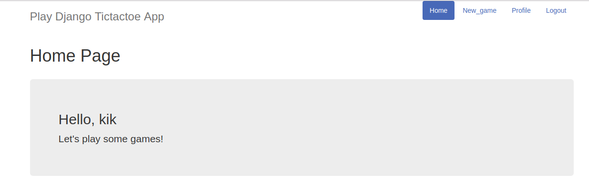
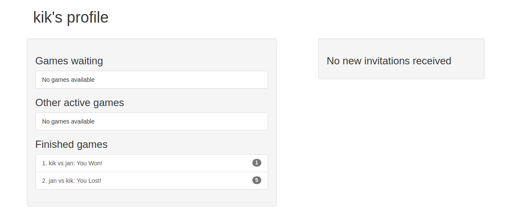
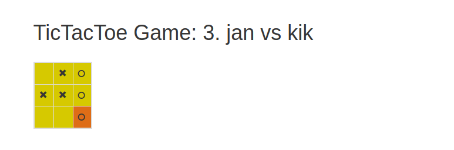

## Django TicTacToe APP

### Description
Django project with user authentication made for simple tic-tac-toe online game. New user can register and invite any of the avallable users for a tic-tac-toe match. Results of all the past matches will be visible in your profile.

This project was made for educational django-example purposes, and it was based on pluralsight course available here:
https://www.pluralsight.com/courses/django-fundamentals

### Quickstart

```
pip install requirements.txt
```
```
python manage.py makemigrations
```
```
python manage.py migrate
```
```
python manage.py runserver
```

### Preview

#### Main Page

#### Your Profile

#### Actual Game



Python 3.5+

Requirements may be outdated and with old version modules.
